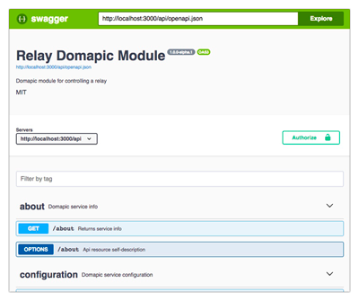

# Relay Domapic Module

> Domapic Module for controlling a relay.

[![Build status][travisci-image]][travisci-url] [![Coverage Status][coveralls-image]][coveralls-url] [![Quality Gate][quality-gate-image]][quality-gate-url] [![js-standard-style][standard-image]][standard-url]

[![NPM dependencies][npm-dependencies-image]][npm-dependencies-url] [![Last commit][last-commit-image]][last-commit-url] <!--[![Last release][release-image]][release-url] -->

[![NPM downloads][npm-downloads-image]][npm-downloads-url] [![License][license-image]][license-url]

---

## Intro

This package starts an API Rest server that controls a relay. It is intended to be used in a Raspberry Pi or any other system supporting the [onoff][onoff-url] library, such as C.H.I.P. or BeagleBone.

It can be used alone, but also can be connected to a [Domapic Controller][domapic-controller-url] to get the most out of it.

## Installation

```bash
npm i relay-domapic-module -g
```

## Start the server

```bash
relay start
```

The server will be started in background using [pm2][pm2-url]

To display logs, type:

```bash
relay logs #--lines=300
```

## Options

The module, apart of all common [domapic services options][domapic-service-options-url], provides custom options for configuring the relay:

* `gpio` - Number defining the Gpio where the relay to be controlled is connected.
* `initialStatus` - Boolean defining the initial status of the relay. Only used first time it is started, next times the server will remember the last status set. _Default is `false`_
* `invert` - If true, the values read from or written to the GPIO should be inverted. Equivalent to `activeLow` option of the `onoff` library .

```bash
# Displays help with detailed information about all available options 
relay start --help
```

## Rest API

When the server is started, you can browse to the provided Swagger interface to get all the info about the api resources:



Apart of all api methods common to all [Domapic Services][domapic-service-url], the server provides two [_Domapic Abilities_][domapic-service-abilities-url] for controlling the relay, which generates three API resources:

* `/api/abilities/switch/action` - Changes the relay status to the provided value.
* `/api/abilities/switch/state` - Returns the relay status.
* `/api/abilities/toggle/action` - Changes the relay status inverting the current value.

## Authentication

The server includes the [Domapic Services][domapic-service-url] authentication method, which is disabled by default for `127.0.0.1`.
You can disable the authentication using the `--authDisabled` option (not recommended if your server is being exposed to the Internet). Read more about [available options in the domapic services documentation][domapic-service-options-url].

If you want to authenticate when requesting from another IPs, look for the api key automatically generated and intended to be used by Domapic Controller when the server is started. You'll find it in the server logs:

```
-----------------------------------------------------------------
Try adding connection from Controller, using the next service Api Key: HMl6GHWr7foowxM40CB6tQPuXt3zc7zE
-----------------------------------------------------------------
```

Provide this api when making any request using the `X-Api-Key` header.

Use the mentioned api key also for authenticating when using the Swagger interface.

## Alternative command line methods

### Not global installation

If the package is not installed globally, you can replace the `relay` command in examples above by `npm run relay --` (commands must be executed inside the package folder in that case)

### Not background mode

If you don't want to use the built-in background runner, you can start the server directly, attaching logs to current `stdout`. Move to the package folder and replace the `relay` command of examples above by `node server.js`. Press CTRL+C to stop the server.


[coveralls-image]: https://coveralls.io/repos/github/javierbrea/relay-domapic-module/badge.svg?branch=master
[coveralls-url]: https://coveralls.io/github/javierbrea/relay-domapic-module
[travisci-image]: https://travis-ci.com/javierbrea/relay-domapic-module.svg?branch=master
[travisci-url]: https://travis-ci.com/javierbrea/relay-domapic-module
[last-commit-image]: https://img.shields.io/github/last-commit/javierbrea/relay-domapic-module.svg
[last-commit-url]: https://github.com/javierbrea/relay-domapic-module/commits
[license-image]: https://img.shields.io/npm/l/relay-domapic-module.svg
[license-url]: https://github.com/javierbrea/relay-domapic-module/blob/master/LICENSE
[npm-downloads-image]: https://img.shields.io/npm/dm/relay-domapic-module.svg
[npm-downloads-url]: https://www.npmjs.com/package/relay-domapic-module
[npm-dependencies-image]: https://img.shields.io/david/javierbrea/relay-domapic-module.svg
[npm-dependencies-url]: https://david-dm.org/javierbrea/relay-domapic-module
[quality-gate-image]: https://sonarcloud.io/api/project_badges/measure?project=relay-domapic-module&metric=alert_status
[quality-gate-url]: https://sonarcloud.io/dashboard?id=relay-domapic-module
[release-image]: https://img.shields.io/github/release-date/javierbrea/relay-domapic-module.svg
[release-url]: https://github.com/javierbrea/relay-domapic-module/releases
[standard-image]: https://img.shields.io/badge/code%20style-standard-brightgreen.svg
[standard-url]: http://standardjs.com/

[onoff-url]: https://www.npmjs.com/package/onoff
[domapic-controller-url]: https://www.npmjs.com/package/domapic-controller
[domapic-service-options-url]: https://github.com/domapic/domapic-service#options
[domapic-service-abilities-url]: https://github.com/domapic/domapic-service#abilities
[domapic-service-url]: https://github.com/domapic/domapic-service
[pm2-url]: http://pm2.keymetrics.io/


